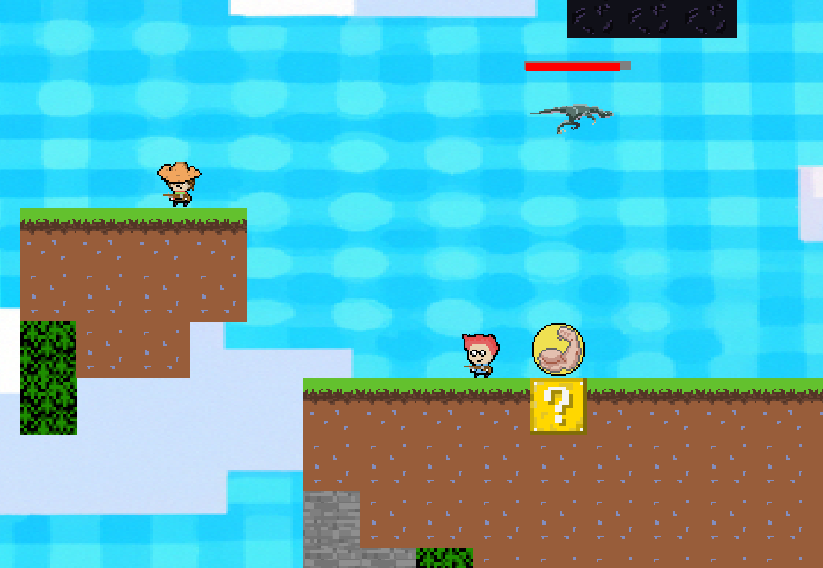

# PROJECT R + L

## Project description 
This is a course project aimed at creating a Java game from almost scratch (an example of the canvas usage and an incomplete state machine parser were provided). We had a constraint: that our game engine be based on customizable state machines. So, initially, we finalized the parser and created the game engine. Then, we developed the game itself that is described right below.

## Classic gameplay phase: `action game`
- A large `arena` (composed of tiles) in a toroidal space, wrapping around from the right side to the left side.
- `Viewport` centered on both players, moving, shrinking, and enlarging according to the distance between the players.
- Two players equipped with weapons capable of shooting in various directions (up, down, left, right, diagonals).

### Objective
- Eliminate the opponent as many times as possible within a modifiable limited time (default 3 minutes 30 seconds).
- The player with the most kills wins the game.
- In case of a tie, a sudden death round occurs, meaning the first to die loses.

### Gameplay
- Multiple playable characters (2 planned for now).
- Avoid enemy shots, environmental traps, and enemy abilities.
- Power-ups as well as penalties will be available on the map at predefined locations. However, which one will appear at a given location is random (see power-ups).
- Players will have the same weapons and movement capabilities: weapons have magazines with a number of bullets (retrievable by a power-up).
- Characters have unique powers and a health bar (in percentage) as well as a death counter for each player (see character definitions).
- If a character dies, they respawn at one of the predefined points randomly.

### The Arena
- The arena is a tilemap (arena in tiles) of a size specific to each game.
- The arena consists mostly of blocks, some of which will have moving platforms.
- The arena is pre-created.

### Originality
- The movement system contains numerous options including dashing.
- The behavior of different moving objects, guided abilities, and players is governed by automata from a .gal file.
- Characters will have unique special abilities (see character section).

## Movements
- The camera provides a side view.
- Players are subject to gravity oriented towards the bottom of the screen (increasing y).
- Players can jump and move from right to left while jumping and on the ground.
- Players can jump to different heights and move at an increasing speed that increases with the time spent moving (maximum speed capped).
- Players have a dash they can aim to move in a direction of their choice.

## Characters
- Each character has two abilities with a unique cooldown time. Each ability will be managed by Pop and Wizz respectively, they also have different sprites.
  ### Mr.Klaxon - Engineer:
    - Spell 1: Turret (DPS)
      - Placed on the ground near the player, its placement is subject to gravity.
      - Stationary and not retrievable.
      - Lifespan and health points, it takes damage over time and from missiles.
      - Detection zone --> continuously shoots at all enemy entities.
    - Spell 2: Missile (DMG)
      - Same behavior as bullets but moves more slowly.
      - One-shot the opponent.
  ### El Chapo - Mexican:
    - Spell 1: Guided Raptor (DMG)
      - One-shot the opponent.
      - Lifespan and health points, it takes damage over time and from missiles.
      - Explodes on the player if it hits or at the end of its lifespan.
      - Runs in a straight line thanks to an automaton and bounces off walls.
    - Spell 2: Refreshing Flask [40%] (HEAL)
      - The player can heal all the damage they have taken.

## Upgrades and Power-ups

Introduce a variety of power-ups and penalties that players can obtain during the game to increase their firepower, speed, health, etc.

- These upgrades can be obtained by finding them scattered throughout the arena.
- Power-ups have temporary effects, adding an additional strategic layer.
- Examples of power-ups:
  - speed x2: (player moves 2x faster)
  - damage x2
  - shield: (player is immune to most damage for a short duration)
  - ammunition: the player recovers a number of magazines
- Examples of penalties:
  - speed /2: the opposing player's speed is halved
  - damage /2: the opposing player's damage is halved
  - vulnerability: the opposing player takes 2x more damage

#### Technical Points:
- Manage player and bullet movements.
- Collision detection for shots and players.
- Viewport with zoom in/out capabilities based on the distance between the two players.
- How to detect a bullet collision (if it moves fast it can catch up to our character, how to detect?). 

---
    AUTHOR: GROUP B
    Polytech'Grenoble, Univ. Grenoble Alpes